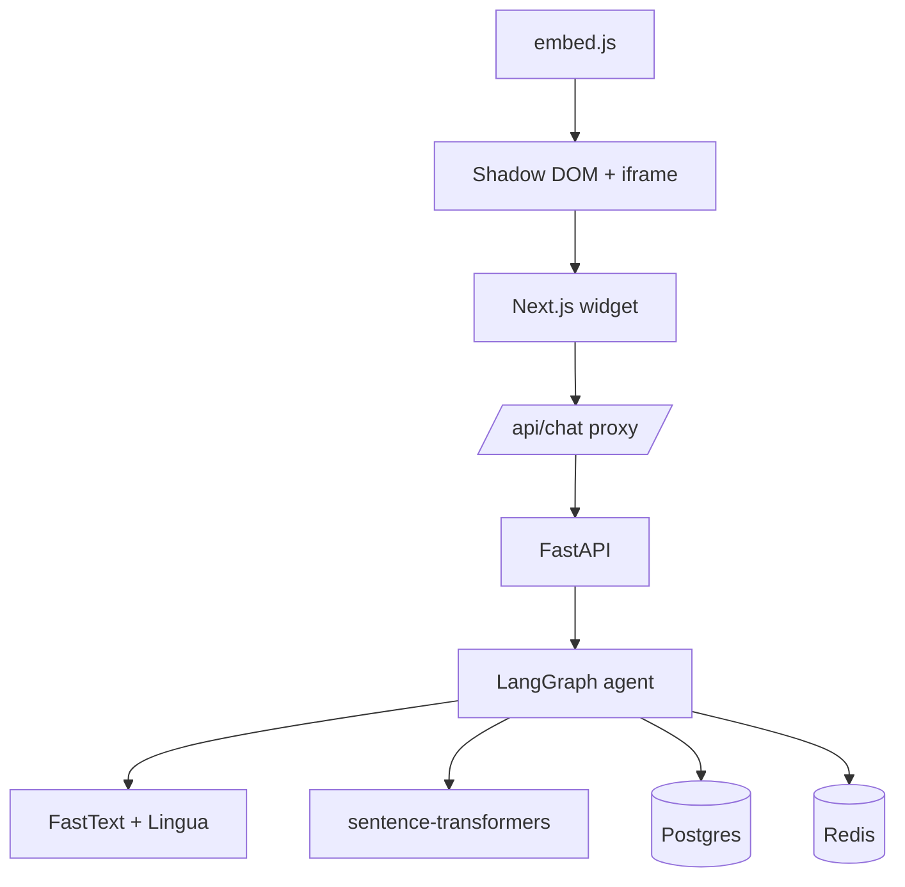

## Problem & context

A Swiss e-commerce site selling jeans needed a shopping assistant that
could (1) drop into the existing site as a single `<script>` tag without
breaking the host CSS, (2) hold a real conversation in the customer's
language across at least English, German, and French, and (3) survive
load patterns typical of retail (cache-hits dominate, but occasional
unique queries hit the LLM and the backend).

The constraint that shaped the architecture: the widget had to be
embeddable on any third-party site without style collisions, and the
LLM logic had to be testable independently of the UI.

## My contribution

Full-stack engineer on a small team (2–5 people). On the front-end I
owned the Next.js 16 widget, the dashboard, the embed script, and the
API proxy layer. On the back-end I worked on FastAPI endpoints
(chat / cache / sync / products), on the LangGraph agent, its
graph, its tools, and its prompts, and on the data layer: SQLModel
schemas, Alembic migrations, the FastText + Lingua language-detection
integration, and the sentence-transformers embedding step inside the
agent's retrieval. Infra (Docker, Redis cache + rate limiter, pytest
suite, Locust load tests) was owned by another contributor; I
integrated against it.

## Architecture (high level)

HOST SITE
WIDGET
BACKEND
DATA + LLM

The widget runs inside a Shadow DOM + iframe combination so the host
site's CSS cannot bleed into it and the widget's styles cannot leak
out. User identity is established through browser fingerprinting
(`@fingerprintjs/fingerprintjs`), no login, no cookies, no session
prompt, and the same fingerprint is used to thread conversation
context across page loads.

## Data & workload

- **Multi-language**: EN, DE, FR detected per-message with a FastText
  classifier backed by Lingua as a fallback. The Swiss market for the
  client makes this the floor, not the ceiling.
- **Embeddings**: sentence-transformers for product / FAQ similarity
  inside the LangGraph agent's retrieval step.
- **Cache strategy**: Redis fronts the LLM path so repeat queries do
  not hit OpenAI. Load tests are parameterised around an 80% cache hit
  rate as the realistic baseline; the unique-query 20% drives the cost
  envelope.
- **Storage**: SQLModel over Postgres for products, sessions, and chat
  state. Alembic for migrations.

## Baseline & alternatives considered

| Option | Why not |
|---|---|
| Direct OpenAI SDK calls from the frontend | Leaks the API key, bypasses rate limiting, no place for retrieval. |
| Raw OpenAI Assistants API without LangGraph | Less control over the conversation graph and tool calls; harder to test offline. |
| Embed via plain `<iframe>` without Shadow DOM | Easier, but the floating button + modal pattern needs DOM access in the host page. |
| Frontend-side language detection | Inconsistent across browsers; backend FastText + Lingua is one source of truth. |
| Auth-based user identity | Adds friction the client did not want; fingerprinting was a deliberate trade-off. |

## Results

| Dimension | Outcome |
|---|---|
| Embedding | Single `<script>` tag, Shadow DOM, works on any host site |
| Language coverage | EN / DE / FR with per-message detection |
| Backend test coverage | 68+ pytest cases (health, chat, cache, sync, scenarios) |
| Load profile validated | 100–200 concurrent users via Locust, 80% cache hit rate |
| Identity model | Fingerprint-based, no auth, no cookie banner |
| Rate limiting | Redis + `fastapi-limiter` on the chat endpoint |
| Observability | Prometheus metrics, structured logs |

Conversion and engagement lift numbers are the client's and not mine
to publish.

## Reproducibility

The repository is private. What is portable:

- **The Shadow-DOM-plus-iframe embed pattern** is the cleanest way to
  drop a chat widget into a third-party site without inheriting its
  CSS. The `public/embed.js` is essentially a 50-line bootstrapper.
- **FastText + Lingua as a layered language detector** is more robust
  than either alone. FastText is fast and good on long text; Lingua
  catches the short, ambiguous messages where FastText is overconfident.
- **The 80/20 cache-hit-rate assumption for load tests** is a realistic
  baseline for a retail chat widget where customers repeatedly ask
  product / sizing / return-policy questions.
- **T3 stack + Biome + Tailwind v4** is a pragmatic Next.js 16 stack
  that I would re-use; the type-safe env via `@t3-oss/env-nextjs`
  caught a real Docker build issue early.

## Risks & trade-offs

The honest trade-offs in this architecture:

- **Fingerprinting is not authentication.** A returning user on a new
  browser is a new user. The client accepted this; in a higher-value
  funnel it would not fly.
- **Shadow DOM blocks the host site from observing the widget.** That
  is the point, but it also means GA / Hotjar / etc. on the host site
  cannot instrument widget interactions without an explicit bridge.
- **LangGraph is a hard dependency.** The conversation graph and tools
  are coupled to it; migrating away later would mean rewriting the
  agent layer.
- **OpenAI is a hard dependency.** Cache absorbs most cost but a
  provider outage stalls the unique-query path. A fallback provider
  was discussed and not built.
- **Multi-language detection is a layered heuristic, not a model.** It
  is right almost always; "almost" matters when a German user gets
  routed to the English prompt.

## What I would do differently

- Add a streaming response path on the chat endpoint from day one.
  Sub-second perceived latency on the first token beats sub-second
  total latency for a chat UI.
- Treat the embed script as a versioned, semver-pinned artefact from
  the start; clients embedding `embed.js` should not be silently
  upgraded.
- Front the backend with structured cost telemetry (tokens in / out
  per session, per language, per cache-miss) so the cost story can be
  told without grepping logs.
- Add a thin abstraction over the LLM provider so a fallback or model
  swap is a config change, not a code change.
- Build an evaluation harness for the agent (golden conversations,
  scored against expected tool calls) instead of relying on pytest
  scenario tests for behaviour coverage.
