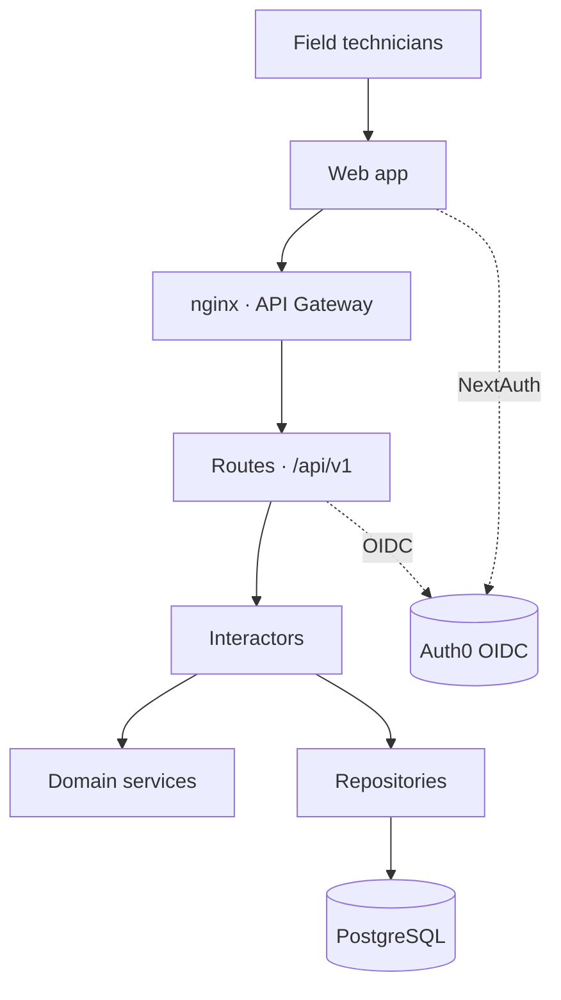

## Problem & context

Agricultural operations in Ecuador track nutrient management across a
deep geographic hierarchy (Province → Canton → Zone → Area → Lot),
each with its own soil samples, crop calendars, and fertirrigation
plans. The existing workflow lived in spreadsheets shared between
agronomists, technicians, and warehouse staff. The platform replaces
that with a single source of truth, scoped by role, with auditable
recommendations and traceable applications back to lots and yield.

The constraint that shaped the architecture: domain calculations
(acid, fertilization, irrigation solution, farmer sources) must be
reproducible and inspectable, not buried inside route handlers.

## My contribution

Frontend & AI developer on the Nutribalance product. Worked across the
Next.js 15 UI and the FastAPI domain layer:

- **Frontend (Next.js 15 App Router):** built feature areas for
  clients, zones, soil analysis, nutritional requirements, extraction
  curves, fertilizer sources, irrigation sessions, the nutrient
  calculator, and the farmer-application tracker. shadcn/ui + Radix
  primitives, Tailwind v4, Recharts for visualisations,
  react-pdf / jsPDF for downloadable reports.
- **Backend integration:** consumed the FastAPI services through a
  centralised API client with Auth0-issued JWTs, scoped per role.
- **AI features:** integrated the recommendation pipeline that adds
  `embedding` and `optimization_score` to recommendation rows so the
  UI can rank and explain results.

Auth0 OIDC, the clean-architecture skeleton on the API side, and the
core domain calculations were a team effort; I built features on top
of them.

## Architecture (high level)

CLIENTS
EDGE
FASTAPI · CLEAN ARCH
DATA + AUTH

The backend follows clean-architecture layering: **Routes →
Interactors → Repositories**, with **Domain services** holding the
calculation logic (acid balance, fertilization plan, irrigation
solution, farmer-source substitution, nutrient solution). FastAPI
dependency injection wires `SessionDep`, `SettingsDep`, and per-route
role dependencies (`CurrentUserDep`, `AdminUserDep`,
`TechnicianOrAdminDep`).

## Data & workload

The domain model captures the operational reality of fertirrigation
in Ecuador, not a generic CRUD shell:

- **Geographic hierarchy**: Province → Canton → Zone → Area → Lot,
  with lots holding GPS coordinates validated by SQL `CheckConstraint`.
- **Users & roles**: ADMIN, TECHNICIAN, WAREHOUSE, with document
  validation for cedula, RUC, and passport.
- **Agronomy**: crops and growth stages, soil samples, nutrient
  sources (enmiendas, granulados, hidrosolubles, bioestimulantes
  foliares), and fertirrigation sessions.
- **Recommendations**: templates (with applications and sources),
  draft → completed → approved → applied session statuses,
  recommendation items per row, plus AI fields (`embedding`,
  `optimization_score`).
- **Operations**: field applications with JSONB weather conditions
  and photo arrays (GIN-indexed), yield records with quality grades
  and revenue tracking.

PostgreSQL connection pool sized for the operational shape: 10
permanent connections + 20 overflow, 60s timeout, 1h recycle,
pre-ping enabled. UUID primary keys, server-default timestamps with
trigger-based `updated_at`.

## Baseline & alternatives considered

| Option | Why not |
|---|---|
| Spreadsheets (status quo) | No role scoping, no audit trail, no calculation reproducibility. |
| Monolithic Django app | Slower to iterate on the API layer; less natural fit for FastAPI's dependency injection and SQLModel. |
| MongoDB document store | Loses the relational guarantees the geographic hierarchy and yield-tracking need. JSONB columns inside PostgreSQL cover the semi-structured cases (weather, photos). |
| Auth handled in-app | Auth0 + JWT + JWKS removes a class of bugs; OIDC middleware validates tokens before routes run. |
| Single service | Gateway-fronted microservices (formulation, recommendation, crops, extraction curves, analysis agent, nutrient system) keep concerns separate and let the analysis agent scale independently. |

## Results

| Dimension | Outcome |
|---|---|
| Backend stack | FastAPI 0.121+, SQLModel, Alembic, Python 3.13, uv-managed |
| Frontend stack | Next.js 15 App Router, React 19, Prisma 6, NextAuth v5, Tailwind v4, shadcn/ui |
| Domain coverage | 8 model groups · 11 route modules · 5 calculation services |
| Auth | Auth0 OIDC with role-based dependencies and `@public` decorator for unauthenticated paths |
| Reports | Downloadable PDFs via react-pdf and jsPDF, with `html2canvas` for embedded charts |
| Reproducibility | Alembic migrations, autogenerated and version-controlled; pre-ping engine; ruff-linted on every commit |

Business volume and per-tenant SLA numbers are confidential to IFG.

## Reproducibility

The platform is internal to IFG Innovaciones Agropecuarias. What is
portable:

- **Clean architecture in FastAPI** with `Routes → Interactors →
  Repositories → Services` keeps calculation logic out of HTTP
  handlers and makes it testable in isolation.
- **`Annotated[T, Depends(T)]` type aliases** (`SessionDep`,
  `MyRepositoryDep`, `MyInteractorDep`) collapse the dependency-
  injection boilerplate into a single import per layer.
- **`ApiResponse[T]` generic envelope** (`{success, message, data}`)
  is one decision that pays off across every endpoint.
- **Auth0 OIDC middleware ordered before CORS** is the kind of detail
  that only matters once it breaks.
- **PostgreSQL JSONB + GIN** for semi-structured weather/photo data
  inside a relational schema, instead of reaching for a document store.

## Risks & trade-offs

- **Six microservices behind one gateway is real surface area.**
  Latency, retries, and per-service auth all become operational
  concerns. The trade-off bought independent scaling for the analysis
  agent and clearer ownership lines per service.
- **Auth0 dependency.** Identity, JWKS rotation, and per-tenant config
  all live in Auth0. Migration off would touch every route's
  middleware contract and the NextAuth provider on the frontend.
- **Prisma + SQLModel split.** Two ORMs across the stack (Prisma for
  Next.js auth tables, SQLModel for the domain API) is the cost of
  letting each side use its native tooling. The Prisma side is scoped
  to NextAuth tables; the domain stays in SQLModel.
- **Custom Prisma client output** (`app/generated/prisma`) keeps the
  client tree-shakable but is a non-default path future contributors
  have to learn.

## What I would do differently

- Push the calculation services behind a thin `pytest` harness with
  fixtures per crop / soil profile so the formulas have regression
  coverage independent of the HTTP layer.
- Introduce per-service OpenAPI clients (generated, not hand-rolled)
  so the Next.js side gets type-safe calls into the FastAPI router.
- Move the recommendation `embedding` + `optimization_score` work
  behind an explicit evaluation harness — right now they are produced,
  but ranking quality is not measured against a held-out reference.
- Front the field-application JSONB weather data with a typed schema
  (Pydantic on write, Zod on read) so the GIN-indexed queries have a
  fighting chance of staying consistent over time.
- Document the geographic-hierarchy invariants (e.g., a Lot's
  coordinates must fall within its Zone's bounds) as database
  constraints rather than only as application-level checks.
